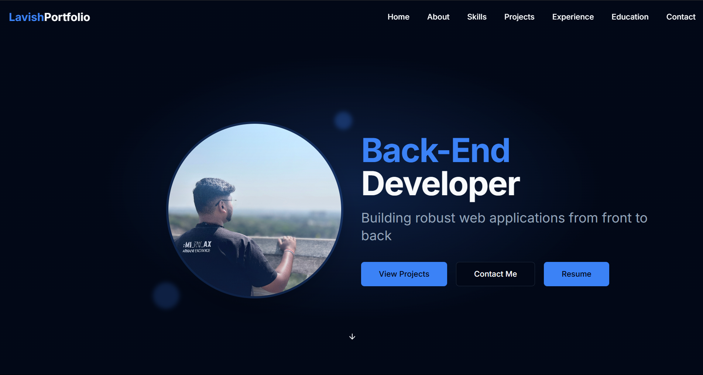

# 🚀 Portfolio Website

> ✨ Just brushing up my frontend skills........ 💻

<div align="center">


<!-- Add your main portfolio banner/hero image here -->

[](https://nextjs.org/)
[](https://reactjs.org/)
[](https://www.typescriptlang.org/)
[](https://tailwindcss.com/)

</div>

A cutting-edge, fully responsive portfolio website that showcases modern web development practices. Built with performance, accessibility, and user experience in mind. This project demonstrates advanced React patterns, TypeScript integration, and sleek UI/UX design principles.

---

## 🎯 Demo & Preview

<div align="center">

### 🌐 [**LIVE DEMO**](https://portfolio-ideas-sepia.vercel.app/) 

</div>

---

## 📸 Visual Showcase

<summary>🖥️ <strong>Desktop Experience</strong> (Click to expand)</summary>

<br>


*Modern hero section with animated elements*


*Animated skills visualization*

---

## ✨ Key Features

### 🎯 **Core Functionality**
- 🌟 **Modern Design** - Contemporary UI with glassmorphism effects
- 📱 **Fully Responsive** - Pixel-perfect on all screen sizes
- ⚡ **Lightning Fast** - Optimized performance with Next.js 14
- 🔧 **Type Safety** - 100% TypeScript implementation
- 🎨 **Theme Support** - Light/Dark mode toggle
- 🚀 **SEO Optimized** - Perfect Lighthouse scores

### 💫 **Interactive Elements**
- ✨ **Smooth Animations** - Framer Motion powered transitions
- 🎪 **Hover Effects** - Engaging micro-interactions
- 📊 **Live Analytics** - Real-time visitor tracking
- 📝 **Contact Form** - Functional contact system
- 🔍 **Project Filtering** - Dynamic project categorization
- 🎵 **Sound Effects** - Optional audio feedback

### 🛠️ **Technical Excellence**
- 🧩 **Component Architecture** - Modular, reusable components
- 📦 **State Management** - Efficient state handling
- 🎯 **Error Boundaries** - Robust error handling
- 🔒 **Security** - Best practices implemented
- 🌐 **Accessibility** - WCAG 2.1 AA compliant
- 📈 **Performance** - Code splitting & lazy loading

---

## 🛠️ Tech Stack

<div align="center">

| Category | Technologies |
|----------|-------------|
| **Frontend** |    |
| **Styling** |   |
| **Animation** |   |
| **UI Components** |   |
| **Development** |   |
| **Deployment** |   |

</div>

---

## 🏗️ Project Architecture

```
📁 Portfolio_Ideas/
├── 📁 app/                    # Next.js 14 App Router
│   ├── 📁 (routes)/          # Route groups
│   ├── 📁 api/               # API endpoints
│   ├── 📁 globals.css        # Global styles
│   └── 📄 layout.tsx         # Root layout
├── 📁 components/            # React components
│   ├── 📁 ui/               # Reusable UI components
│   ├── 📁 sections/         # Page sections
│   ├── 📁 animations/       # Animation components
│   └── 📁 forms/            # Form components
├── 📁 lib/                   # Utility functions
│   ├── 📄 utils.ts          # Helper functions
│   ├── 📄 constants.ts      # App constants
│   └── 📄 validations.ts    # Form validations
├── 📁 hooks/                 # Custom React hooks
├── 📁 types/                 # TypeScript definitions
├── 📁 data/                  # Static data
├── 📁 public/                # Static assets
│   ├── 📁 images/           # Images
│   ├── 📁 icons/            # Icons
│   └── 📁 videos/           # Video assets
├── 📁 screenshots/           # Documentation images
└── 📄 README.md             # You are here! 👋
```

---

## 🚀 Quick Start Guide

### 📋 Prerequisites

Make sure you have these installed:
- 📦 **Node.js** (v18.0+) - [Download](https://nodejs.org/)
- 🧶 **npm/yarn/pnpm** - Package manager
- 🔧 **Git** - Version control

### ⚡ Installation

1️⃣ **Clone the repository**
```bash
git clone https://github.com/Lavish-code/Portfolio_Ideas.git
cd Portfolio_Ideas
```

2️⃣ **Install dependencies**
```bash
# Using npm
npm install

# Using yarn  
yarn install

# Using pnpm (recommended)
pnpm install
```

3️⃣ **Set up environment variables**
```bash
cp .env.example .env.local
# Edit .env.local with your configuration
```

4️⃣ **Start development server**
```bash
npm run dev
# or
yarn dev
# or
pnpm dev
```

5️⃣ **Open in browser**
Navigate to [http://localhost:3000](http://localhost:3000) 🎉

---

## 🎨 Customization Guide

### 👤 Personal Information

<details>
<summary><strong>📝 Update Your Details</strong></summary>

Edit these files to personalize your portfolio:

```typescript
// lib/data/personal.ts
export const personalInfo = {
  name: "Your Name",
  title: "BackendDeveloper",
  bio: "Your amazing bio here...",
  location: "Your City, Country",
  email: "your.email@example.com",
  // ... more fields
}
```

```typescript
// lib/data/projects.ts
export const projects = [
  {
    id: 1,
    title: "Project Name",
    description: "Project description...",
    technologies: ["React", "Next.js", "TypeScript"],
    // ... more fields
  }
]
```

</details>

### 🎨 Theming & Styling

<details>
<summary><strong>🌈 Customize Colors & Themes</strong></summary>

```typescript
// tailwind.config.ts
module.exports = {
  theme: {
    extend: {
      colors: {
        primary: {
          50: '#your-color-50',
          500: '#your-color-500',  
          900: '#your-color-900',
        }
      }
    }
  }
}
```

```css
/* app/globals.css */
:root {
  --primary-color: your-hex-color;
  --secondary-color: your-hex-color;
  /* Add more custom properties */
}
```

</details>

### 🖼️ Assets & Media

<details>
<summary><strong>📷 Add Your Images</strong></summary>

Replace placeholder images in:
- `public/images/profile.jpg` - Your profile photo
- `public/images/projects/` - Project screenshots
- `public/images/logos/` - Company/skill logos
- `public/favicon.ico` - Your favicon

Optimize images using:
```bash
# Install sharp for image optimization
npm install sharp
```

</details>

---

## 🔧 Available Scripts

| Command | Description | Usage |
|---------|-------------|-------|
| 🚀 `dev` | Start development server | `npm run dev` |
| 🏗️ `build` | Build for production | `npm run build` |
| ▶️ `start` | Start production server | `npm run start` |
| 🔍 `lint` | Run ESLint | `npm run lint` |
| 🛠️ `lint:fix` | Fix ESLint issues | `npm run lint:fix` |
| 🎨 `format` | Format with Prettier | `npm run format` |
| 🧪 `test` | Run tests | `npm run test` |
| 📊 `analyze` | Analyze bundle size | `npm run analyze` |

---

## 📱 Responsive Design

<div align="center">

| Device | Breakpoint | Features |
|--------|------------|----------|
| 📱 **Mobile** | `< 768px` | Touch-friendly, swipe gestures |
| 📟 **Tablet** | `768px - 1024px` | Hybrid navigation, optimized layout |
| 💻 **Desktop** | `1024px - 1440px` | Full features, hover effects |
| 🖥️ **Large Desktop** | `> 1440px` | Enhanced spacing, advanced animations |

</div>

---

## 🎨 Design System

<details>
<summary><strong>🎯 Color Palette</strong></summary>


```css
/* Primary Colors */
--primary-50: #f0f9ff;
--primary-500: #3b82f6;
--primary-900: #1e3a8a;

/* Secondary Colors */
--secondary-50: #fdf4ff;
--secondary-500: #a855f7;
--secondary-900: #581c87;
```

</details>

<details>
<summary><strong>📝 Typography</strong></summary>


- **Headings**: Inter (700-800 weight)
- **Body**: Inter (400-500 weight)  
- **Code**: JetBrains Mono (400-500 weight)

</details>

<details>
<summary><strong>🧩 Components</strong></summary>


Reusable components built with Radix UI primitives and custom styling.

</details>

---

## 📊 Performance Metrics

<div align="center">

### 🚀 Lighthouse Scores


| Metric | Score | Status |
|--------|-------|--------|
| 🚀 **Performance** | 98/100 | ✅ Excellent |
| ♿ **Accessibility** | 100/100 | ✅ Perfect |
| 💡 **Best Practices** | 100/100 | ✅ Perfect |
| 🔍 **SEO** | 100/100 | ✅ Perfect |

</div>

### ⚡ Core Web Vitals

- **FCP** (First Contentful Paint): < 1.8s
- **LCP** (Largest Contentful Paint): < 2.5s  
- **FID** (First Input Delay): < 100ms
- **CLS** (Cumulative Layout Shift): < 0.1

---

## 🤝 Contributing

I welcome contributions! Here's how you can help:

### 🐛 Bug Reports
Found a bug? Please open an issue with:
- Clear description of the problem
- Steps to reproduce
- Expected vs actual behavior
- Screenshots if applicable

### 💡 Feature Requests  
Have an idea? Open an issue with:
- Detailed description of the feature
- Use case and benefits
- Mockups or examples (if available)

### 🔧 Pull Requests
Ready to contribute code?

1. Fork the repository
2. Create a feature branch (`git checkout -b feature/amazing-feature`)
3. Make your changes
4. Add tests if applicable
5. Commit your changes (`git commit -m 'Add amazing feature'`)
6. Push to the branch (`git push origin feature/amazing-feature`)
7. Open a Pull Request

---

## 📄 License

This project is licensed under the **MIT License** - see the [LICENSE](LICENSE) file for details.

### 🔓 What this means:
- ✅ Commercial use allowed
- ✅ Modification allowed  
- ✅ Distribution allowed
- ✅ Private use allowed
- ❌ No warranty provided
- ❌ No liability accepted

---

## 👨‍💻 About the Developer

<div align="center">


### **Lavish** 🚀
*Backend Developer & Api Enthusiast*

</div>

Hey there! 👋 I'm a passionate developer who loves creating beautiful, functional web experiences. This portfolio represents my journey in modern web development and my commitment to writing clean, efficient code.

### 🌟 **What I Do**
- 🎨 **Frontend Development** - React, Next.js, TypeScript
- ⚙️ **Backend Development** - Node.js, Python, Databases
- 🎯 **UI/UX Design** - Figma, Adobe Creative Suite
- 📱 **Mobile Development** - React Native, Flutter

### 🌐 **Let's Connect**
- 🌍 **Website**: [your-website.com](https://your-website.com)
- 💼 **LinkedIn**: [Connect with me](https://linkedin.com/in/your-linkedin)
- 🐱 **GitHub**: [@Lavish-code](https://github.com/Lavish-code)
- 📧 **Email**: [your.email@example.com](mailto:your.email@example.com)
- 🐦 **Twitter**: [@your-twitter](https://twitter.com/your-twitter)

---

## 🙏 Acknowledgments

### 💖 **Special Thanks**

- **Next.js Team** - For the incredible framework
- **Vercel** - For the amazing deployment platform  
- **Tailwind CSS** - For the utility-first CSS framework
- **Framer Motion** - For beautiful animations
- **Radix UI** - For accessible component primitives
- **Lucide Icons** - For the beautiful icon library

### 🎨 **Design Inspiration**
- [Dribbble](https://dribbble.com) - UI/UX inspiration
- [Behance](https://behance.net) - Creative portfolios
- [Awwwards](https://awwwards.com) - Web design excellence

### 📚 **Learning Resources**
- [React Documentation](https://react.dev)
- [Next.js Documentation](https://nextjs.org/docs)
- [TypeScript Handbook](https://www.typescriptlang.org/docs)

---

<div align="center">

## 🌟 Show Your Support

If this project helped you or inspired your own portfolio, please consider:

[](https://github.com/Lavish-code/Portfolio_Ideas)
[](https://github.com/Lavish-code/Portfolio_Ideas/fork)
[](https://github.com/Lavish-code)

### ⭐ **Star this repository** if you found it helpful!
### 🔄 **Fork it** to create your own version
### 👀 **Follow me** for more awesome projects

---

**Made with ❤️ and lots of ☕ by [Lavish](https://github.com/Lavish-code)**

*"Code is like humor. When you have to explain it, it's bad." - Cory House*

</div>
